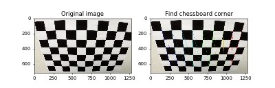
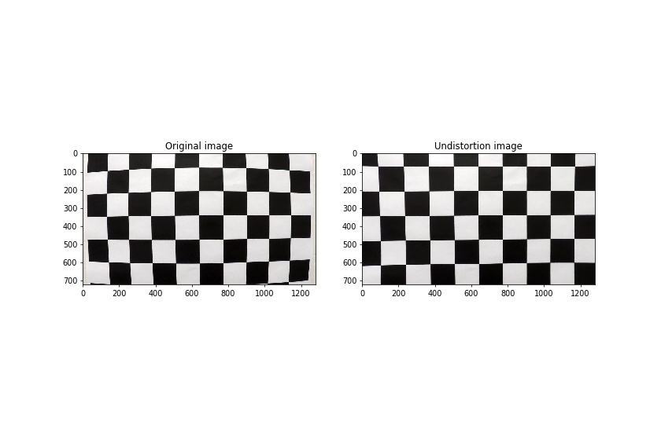
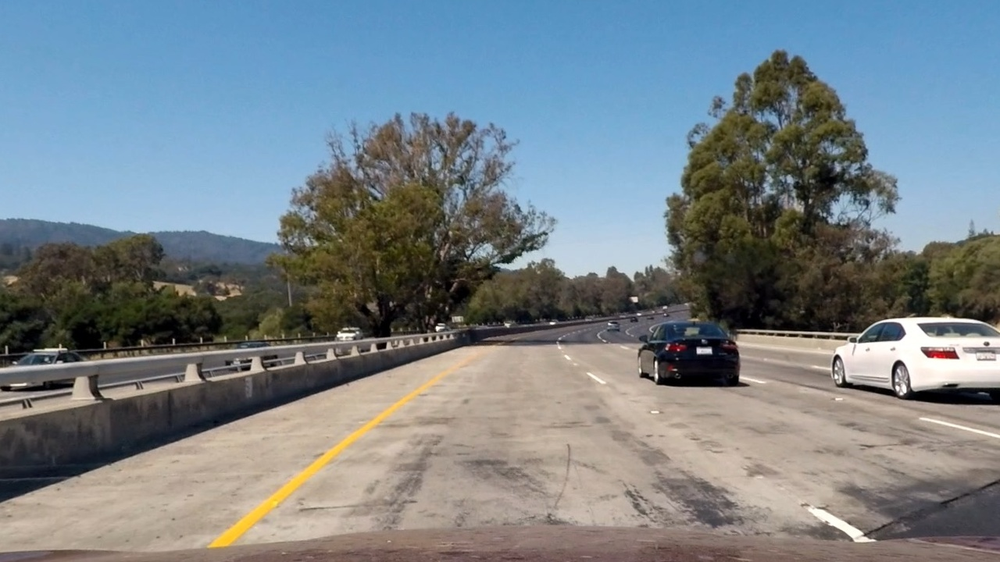
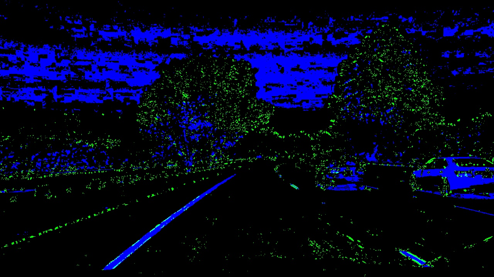
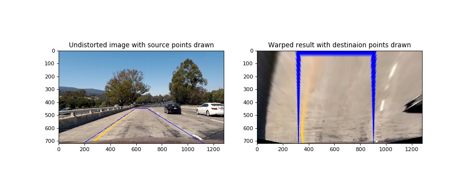
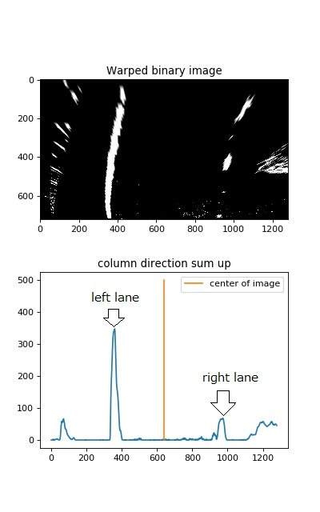
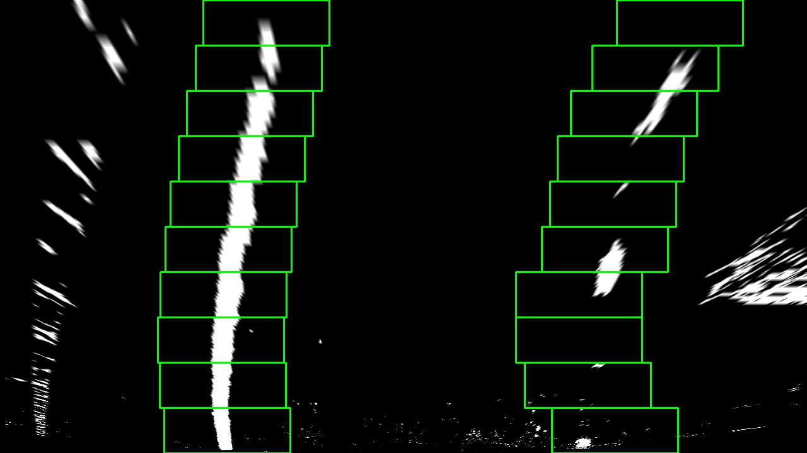
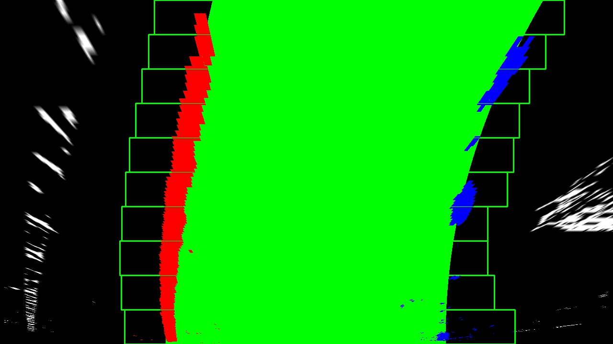
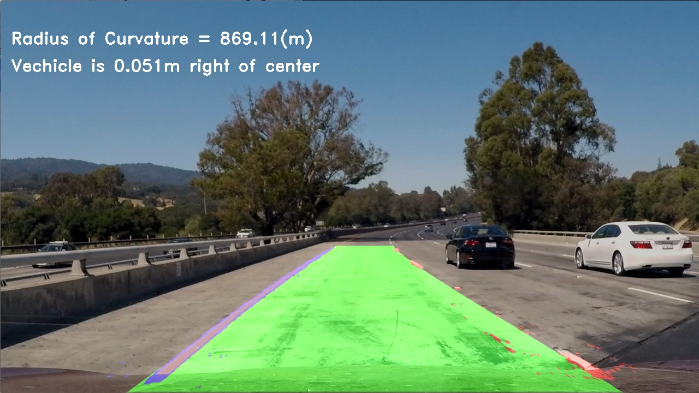
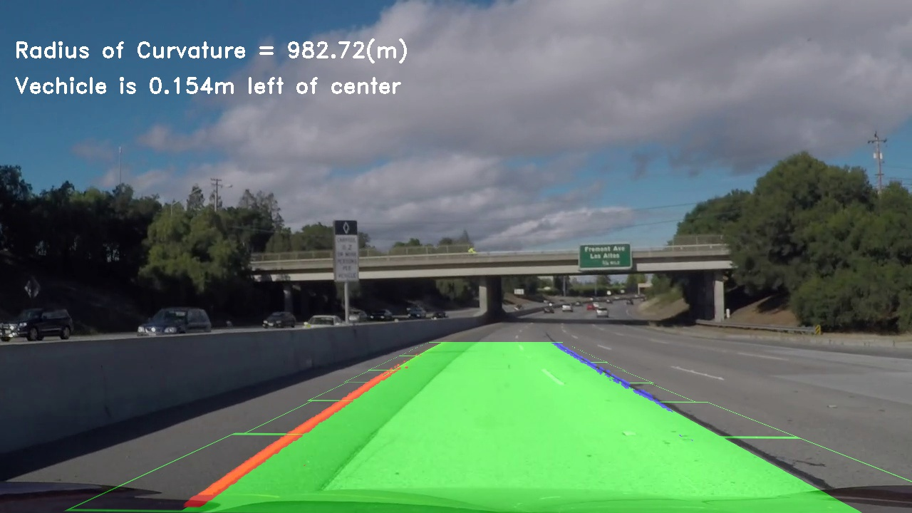

## Writeup

---

**Advanced Lane Finding Project**

The goals / steps of this project are the following:

* Compute the camera calibration matrix and distortion coefficients given a set of chessboard images.
* Apply a distortion correction to raw images.
* Use color transforms, gradients, to create a thresholded binary image.
* Apply a perspective transform to rectify binary image ("birds-eye view").
* Detect lane pixels and fit to find the lane boundary.
* Determine the curvature of the lane and vehicle position with respect to center.
* Warp the detected lane boundaries back onto the original image.
* Output visual display of the lane boundaries and numerical estimation of lane curvature and vehicle position.


## [Rubric](https://review.udacity.com/#!/rubrics/571/view) Points

### Here I will consider the rubric points individually and describe how I addressed each point in my implementation.  

---

### Camera Calibration

#### 1. Briefly state how you computed the camera matrix and distortion coefficients. Provide an example of a distortion corrected calibration image.

I calculated using chess board images(images in '../camera_cal/').
First, I find chess board corners using cv2.findChessboardCorners(). Add this found corners to 'imgpoints' array.
I checked it with cv2.drawChessboardCorners() to see if it was actually found. One example is the following image. This code is implemented with `findPoints()` of class FindLane of `py_code/find_lane.py`.



Next, I calculate the camera distortion using 'imgpoints' array. At that time, I use cv2.calibrateCamera(). With this function, parameters(mtx, dist) necessary for camera distortion correction will be returned. This code is implemented with `calcDistort()` of class FindLane in `py_code/find_lane.py`.
Also, once this is done, the parameters required for camera distortion correction are given to the FindLane class.

Finally, cv2.undistort() is executed on the image using the parameters(mtx, dist) to correct distortion.
This code is implemented with `undistImage()` of class FindLane in `py_code/find_lane.py`.
One example is the following image.




### Pipeline (single images) (in `py_code/image_main.py`)

#### 1. Provide an example of a distortion-corrected image.

I apply `undistImage()` to 'test_images / test1.jpg'.
To demonstrate this step, I will describe how I apply the distortion correction to one of the test images like this one:




#### 2. Describe how (and identify where in your code) you used color transforms, gradients or other methods to create a thresholded binary image.  Provide an example of a binary image result.

I used a combination of color and gradient thresholds to generate a binary image (thresholding steps at lines 215 through 263 in `color_gradient.py`).  Here's an example of my output for this step. The blue part is taken out from the color space information. The green part is taken from the gradient.



#### 3. Describe how (and identify where in your code) you performed a perspective transform and provide an example of a transformed image.

I use `birdsEye()` class `WarpRegionMask` to do the perspective transform. `birdsEye()` appears in lines 29 through 39 in the file `py_code/warp_and_region_mask.py`. In order to do perspective transform, you need to create the class `WarpRegionMask` by giving the parameters source(`src`) and destination (`dst`) points.
I find the source and destination points by try-and-error. The points are below.
The points are for project_video.mp4. It must be changed in the challenge video or harder challenge video.
```python
src = np.float32(
    [[685, 450],
     [1120, 720],
     [190, 720],
     [595, 450]])
dst = np.float32(
    [[900, 0],
    [900, 720],
    [320, 720],
    [595, 450]])
```

I verified that my perspective transform was working as expected by drawing the `src` and `dst` points onto a test image and its warped counterpart to verify that the lines appear parallel in the warped image.



#### 4. Describe how (and identify where in your code) you identified lane-line pixels and fit their positions with a polynomial?

I perform a perspective transform to binary image of color and gradient thresholds. And add the place where the pixel is 1 in the column direction. Then below the middle of the histogram, the place with the largest value is recognized as the left lane. Also above the middle of the histogram, the place with the largest value is recognized as the right lane.
Here's an example of my output for this step.



Next, based on the index of the left lane and right lane found in the histogram, execute the sliding window and find the pixels of the left lane and the right lane respectively. This code is in `FindLane.find_lane_pixels()` of `py_code/find_lane.py`.
Here's an example of my output for this step.　The pixel inside this green window is the lane pixel.




Finally, apply `np.polyfit()` to this pixels and approximate as a curve of a quadratic function of the left lane and the right lane respectively. This function calculate A, B and C below the equation.

$$ f(y) = Ay^2 + By + C $$

This code is in `FindLane.fit_polynomial()` of `py_code/find_lane.py`.
Here's an example of my output for this step. The inside of the recognized lane is colored in green.




#### 5. Describe how (and identify where in your code) you calculated the radius of curvature of the lane and the position of the vehicle with respect to center.

The curvature is calculated using coefficients of the quadratic function obtained above. The curvature formula is as follows:

$$ R_{curve} = \frac{(1+(2A + B)^2)^{\frac{3}{2}}}{|2A|} $$

This is obtained for each of the left and right lanes, and the average is the curvature. Also, this code is in `FindLane.measure_curvature_real()` of `py_code/find_lane.py`.

The ideal car position is the middle of the recognized left lane and right lane, and the actual car position is the position of the center of the image. Then, I calculate this difference. This code is in `FindLane.calcDiffCarPosition()` of `py_code/find_lane.py`.

Finally, I insert this curvature and the position of the car in the image. Here's an example of my output for this step.


#### 6. Provide an example image of your result plotted back down onto the road such that the lane area is identified clearly.

I implemented this step in `WarpRegionMask.returnBirdsEye()` of `py_code/warp_and_region_mask.py`. Then, I insert this curvature and the position of the car in the image. Here's an example of my output for this step.



---

### Pipeline (video)

#### 1. Provide a link to your final video output.  Your pipeline should perform reasonably well on the entire project video (wobbly lines are ok but no catastrophic failures that would cause the car to drive off the road!).

Here's a [link to my video result](./test_videos_output/project_video.mp4)

---

### Discussion

#### 1. Briefly discuss any problems / issues you faced in your implementation of this project.  Where will your pipeline likely fail?  What could you do to make it more robust?

- In pipeline(single image) perspective transform, `src` is statically determined. If we can find this dynamically, we believe that recognition accuracy will improve.
- When executing a pipeline with challenge video, it fails like the following picture. This is because it responds to the black line by the gradient thresholds. So it may improved by subtracting the place where the black in the grayscale.



- In harder_challenge_video, there is a problem that the sun light is reflected on the windshield of the car and the line can not be recognized. This implies that it is the limit when recognizing a lne by a camera.
